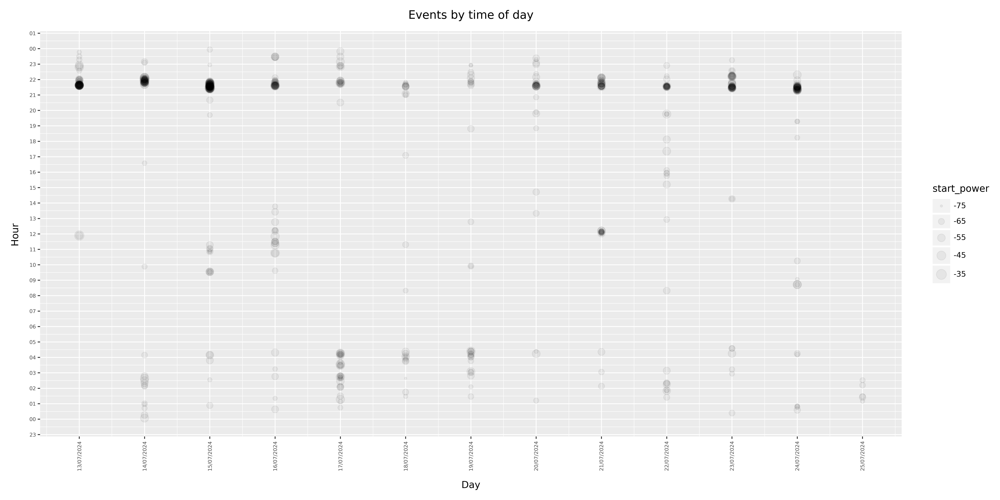

# SDRPlayBatDetector

Hat tip to TechMinds for outlining the [art of the possible](https://www.youtube.com/watch?v=-ikeMSn35T0) here.

Now have more insight as to when these fascinating beasties visit my back garden.

# Installation

Tested on Pi Debian Bookwork 64bit 2024-03-15.

I connected [one of these](https://www.ebay.co.uk/itm/115592159244) to [one of those](https://www.sdrplay.com/sdrplay-announces-the-rspdx-r2/) for this.

Some experience will be needed with Linux, GnuRadio and a sensor / SDR receiver pair that works in the range 40 to 120 kHz or so.

```console
sudo apt-get update upgrade
sudo apt-get install cmake gnuradio python3-paho-mqtt ffmpeg
pip3 install -r requirements.txt
```

Then follow the instructions here to install required APIs:

https://www.sdrplay.com/api/

https://github.com/fventuri/gr-sdrplay3

# Design


This sketch uses an asistant python program called [zmqpubsink.py](./zmqpubsink.py) which looks for bat activity as defined by the [config file](SDRPlayBatDetector.ini) and

- Sends out frequency shifted audio to a remote location.
- Creates a csv file of events for further analysis and visualisation.
- Optionally sends events to your messaging server.

# Configuration file

Edit the [config file](SDRPlayBatDetector.ini) to adjust the following

| Key | Notes |
|    :----:   |          :--- |
| sample_rate  | Suggest leaving, may need to subsequently tweak the decimation and interpolation values on the graph. |
| decimation | Default works well. |
| fft_resolution | Ditto. |
| fft_frame_rate  | Ditto. |
| audio_conversion_gain  | Ditto. |
| start_freq  | Where to start looking for bats. |
| end_freq  | If you need to increase this, you will need to increase the sample rate and then maybe tweak the decimation and interpolation values on the graph. |
| freq_bin_range  | The fft is re-aggregrated based on this size to allow for more detailed but not over the top event generation. |
| trigger_gain_threshold  | Spike in received power required to generate an event. |
| trigger_abs_threshold  | So not use event if power is less than this |
| retrigger_seconds | Do not generate more than one event in this 'comparison against rolling average' interval. |
| bin_count_threshold | Must see activity over this number of bins to be a valid event |
| mqtt_ip_address  | Optional messaging server. |
| mqtt_username  | Ditto. |
| mqtt_password  | Ditto. |
| mqtt_topic  | Ditto. |

# Starting and stopping

```console
bash start.sh
```

```console
bash stop.sh
```

# Example output

A real-time csv file is created with event information:

***timestamp,timestamp-utc,start_freq,start_power,end_freq,end_power,number_of_bins_threshold_exceeded***


```console
pi@ShedPi:~/Documents/SDRPlayBatDetector $ tail -f SDRPlayBatDetector.csv 
2024-07-11 21:30:23,1720729823.81406,51592,-60,55732,-68,2
2024-07-11 21:30:28,1720729828.13749,55010,-60,75000,-73,4
2024-07-11 21:30:37,1720729837.46326,51836,-53,55000,-62,2
2024-07-11 21:32:28,1720729948.55296,53301,-51,97441,-74,4
2024-07-11 21:32:31,1720729951.10158,60615,-64,75977,-65,3
2024-07-11 21:32:38,1720729958.09749,51348,-41,95732,-68,6
```

# Configuration

Edit the gnuradio sketch source block if you have a different source than the rspdx-r2.

For remote audio place you remote IP and port in the [UDP sink](./sketch.png) block and run this at the remote end:

```console
ffplay -f f32le -ar 25000 -fflags nobuffer -nodisp -i udp://127.0.0.1:50243 -af "volume=2.0"
```
Note that in the line above, 25000 comes from sample_rate/decimation in the ini file.

# Notes

To visualise output a venv is required so not to mess up the dependancy sensitive GnuRadio. To set this up:

```console 
python -m venv venv
source venv/bin/activate
pip3 install plotnine
exit
```

Then to subsequently use and create [events-by-timeofday.jpg](./example-events-by-timeofday.jpg) and [events-by-frequency.jpg](./example-events-by-frequency.jpg):

```console
bash ./visualise.sh
```



Enjoy!

